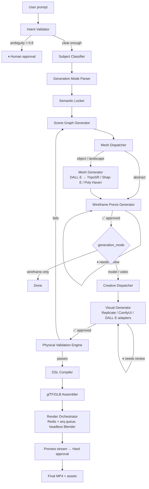

# Cinematic Video Creator

AI-native cinematic production pipeline. Turns a single text prompt into a finished short cinematic ad through a deterministic, schema-driven **LangGraph state machine** that produces strictly typed Blender DSL JSON, with downstream layers handling visual generation, 3D render, and an in-browser viewport.

> **Status:** active development. The core orchestration engine, FastAPI backend, Next.js workspace, and headless Blender render pipeline are implemented and evolving (Plan1 → Plan11). See [`plans/`](plans/) for the phased build history and [`docs/ARCHITECTURE_SNAPSHOT.md`](docs/ARCHITECTURE_SNAPSHOT.md) for the current implementation state.

## What this is

In plain terms: you type something like *"a modern, cinematic ad for a new kurti collection, slow-motion, warm tones"*, and the system turns that sentence into an actual short video — camera moves, lighting, staged 3D objects, generated background art — without you having to touch Blender, a 3D viewport, or a prompt-engineering tool for each shot.

What makes it different from "prompt → video" wrappers around a single model is that nothing is left to chance inside a black box. Every stage of the pipeline is a typed, validated step with a name, a defined input/output shape, and a checkpoint you can rewind to. The system asks for your approval at the two moments that matter — when your intent is ambiguous, and before it spends GPU time on a render — and otherwise gets out of your way.

## How it works — the flow

The pipeline is a single **LangGraph `StateGraph`**: one authoritative state object (`AgentState`) that moves through a fixed sequence of typed nodes, with a few conditional forks for approvals, retries, and subject type. Nothing is a "chat with an agent" — every node is a plain function with one job, and the graph is checkpointed after every step so any run can be paused, inspected, or rewound.



### Step by step

1. **Intent Validator** — an LLM call with a structured-output contract turns your raw prompt into a typed `IntentSpec`, then Python re-validates it against hard rules (aspect ratio, duration cap, banned terms) and computes an `ambiguity_score`. If the prompt is too vague (`> 0.8`), the graph pauses for **human approval** instead of guessing.
2. **Subject Classifier** — a small structured-output call labels what you're asking for: `object`, `landscape`, or `abstract`. This decides which generation pathway runs later (a real 3D mesh vs. wireframe primitives).
3. **Generation Mode Parser** — a deterministic keyword heuristic decides how far the pipeline should go this run: stop at `wireframe` (layout only), stop at `model` (staged 3D, no video), or go all the way to `video`. This lets you iterate cheaply on blocking before paying for a full render.
4. **Semantic Locker** — diffs the current intent against the previous checkpoint and locks stable elements (garment, character, subject) so they don't drift or get regenerated on the next iteration.
5. **Scene Graph Generator** — an LLM call produces the actual scene as a strictly typed `BlenderDsl` document (camera, lights, objects, transforms). Any attempt to violate a semantic lock triggers a capped retry.
6. **Mesh Dispatcher / Mesh Generator** — for real objects and landscapes, this stage produces an actual 3D asset: a reference image (DALL·E) is turned into a mesh via local TripoSR/Shap-E, or a landscape is pulled from Poly Haven. Abstract scenes skip this and stay on primitive geometry.
7. **Wireframe Previs Generator** — a pure-Python (no LLM) node compiles the scene graph into camera shots and renders a wireframe previsualization. This is the first **approval checkpoint** — cheap to produce, cheap to reject and retry.
8. **Creative Dispatcher → Visual Generator** — once the layout is approved, the system walks the scene graph and emits creative-generation requests (background, subject dressing, FX) to provider adapters (Replicate, ComfyUI, DALL·E, local Docker models) behind a provider-agnostic Creative Abstraction Layer. This is the second **approval checkpoint** — the "hard" one, right before expensive GPU work.
9. **Physical Validation Engine** — zero-LLM, pure geometry/spatial checks (camera-vs-object collisions, focal length sanity, duration caps). Fails fast and routes back to scene generation on error, rather than letting a broken scene reach the renderer.
10. **DSL Compiler → glTF/GLB Assembler** — promotes approved assets into final scene objects and exports a `.glb`, the universal exchange format shared by the Blender backend and the Three.js frontend, guaranteeing both render the same scene.
11. **Render Orchestrator** — a Redis + `arq` task queue runs the headless Blender render with budget and concurrency limits, streaming preview frames back to the UI before committing to the final MP4 export.

Throughout, the **Next.js / React Three Fiber** frontend mirrors the same validated scene graph in a live 3D viewport, so what you approve is exactly what gets rendered — not a separate preview that can drift from the backend's truth.

## Read these in order

1. [`docs/ARCHITECTURE.md`](docs/ARCHITECTURE.md) — the vision and the layered architecture (what we're building and why).
2. [`plans/Plan1.md`](plans/Plan1.md) — **LangGraph orchestration engine**: AgentState, graph nodes, conditional edges, `MemorySaver` checkpointing. Backend-only, runnable via `main.py`.
3. [`plans/Plan2.md`](plans/Plan2.md) — FastAPI surface + Next.js two-panel workspace shell + canon/lock persistence + approval-resume flow.
4. [`plans/Plan3.md`](plans/Plan3.md) — Creative Abstraction Layer: Replicate adapter, Universal Asset Registry, layered (subject/background/FX) generation.
5. [`plans/Plan4.md`](plans/Plan4.md) — Blender DSL + Physical Validation Engine + glTF/glb exchange.
6. [`plans/Plan5.md`](plans/Plan5.md) — Three.js / R3F viewport with Operational Transformations and reversibility timeline.
7. [`plans/Plan6.md`](plans/Plan6.md) — Render orchestrator: arq + Redis, preview streaming, hard-gated final render to mp4.
8. [`plans/Plan7.md`](plans/Plan7.md) — Memory hardening: five-tier hierarchical memory + semantic retrieval of rejections.
9. [`plans/Plan8.md`](plans/Plan8.md)–[`Plan11.md`](plans/Plan11.md) — local-first text→3D pathway (subject classification, TripoSR/Shap-E meshes, Poly Haven landscapes, reference-image isolation).

Each phase is independently shippable and has an end-to-end verification section at the bottom.

## Constraints

- **Local-first on macOS, no local GPU (beyond what's Dockerized).** Visual generation routes to Replicate (or other remote providers via adapters). Mesh generation runs in local Docker services (TripoSR, Shap-E). Blender runs locally headless.
- **Backend orchestrator**: Python 3.11+ + **LangGraph** (`StateGraph`, `MemorySaver`/SQLite checkpointing for time-travel) + **LangChain Core / langchain-openai** (`with_structured_output()` for typed LLM calls) + **Pydantic v2** for state and DSL schemas.
- **HTTP surface**: FastAPI wrapping the LangGraph engine; SSE/WS for state streaming.
- **Frontend**: Next.js 14 (App Router) + Tailwind + Zustand + React Three Fiber.
- **OpenAI is used only for typed structured JSON** (intent extraction, scene-graph generation, summaries) and DALL·E reference images feeding local mesh generation. Never for raw `bpy` scripting.

## Repo layout

```
.
├── apps/
│   ├── orchestrator/         # Plan1 — LangGraph engine (state, nodes, graph, main.py)
│   │   ├── src/orchestrator/
│   │   │   ├── state.py
│   │   │   ├── graph.py / routing.py / llm.py
│   │   │   ├── schemas/      # intent, dsl, canon, creative, mesh_asset, previsualization
│   │   │   ├── nodes/        # intent_validator, subject_classifier, scene_graph_generator, ...
│   │   │   ├── cinematics/   # camera planning
│   │   │   └── rendering/    # blender_runtime, wireframe previs, sheet composer
│   │   └── tests/
│   ├── api/                  # Plan2+ — FastAPI surface
│   │   └── src/api/
│   │       ├── adapters/     # Replicate, ComfyUI, DALL·E, TripoSR, Shap-E, Poly Haven
│   │       ├── memory/       # canon, UAR, working memory, retrieval
│   │       ├── queue/        # arq render worker, dispatch, cancellation
│   │       ├── render/       # glTF builder, scene compiler
│   │       └── routes/       # approvals, locks, checkpoints, render, forks, ...
│   └── web/                  # Plan2+ — Next.js workspace
│       ├── app/(workspace)/
│       └── components/
│           ├── ControlPanel/ # prompt composer, approvals, timeline, budget
│           └── RenderStudio/ # R3F viewport, GLTF scene, camera rig
├── workers/render/           # headless Blender render runner
├── docker/                   # diffusers, triposr, shap_e local inference services
├── plans/                    # phased build plans (Plan1–Plan11)
├── docs/
│   ├── ARCHITECTURE.md
│   └── ARCHITECTURE_SNAPSHOT.md
└── docker-compose.yml         # redis + local inference services
```

## How to extend a plan

- Treat each `PlanN.md` as a versioned contract. If you change scope, add an "Amendments" section at the bottom rather than rewriting in place.
- The "Critical files to create" section is the canonical filename list — don't deviate without updating the plan.
- The "Verification" section is the acceptance criteria — a phase isn't done until every numbered item passes.
